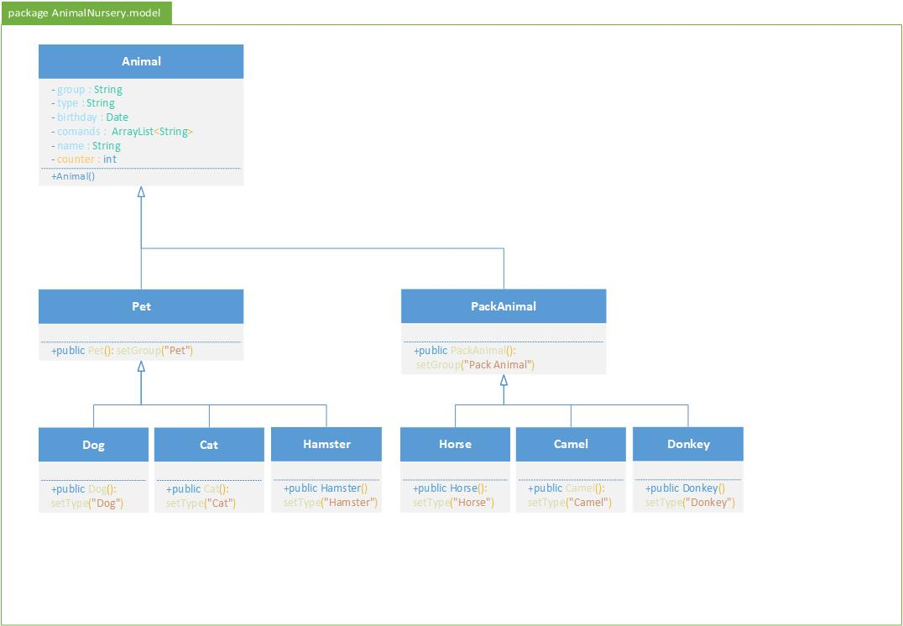
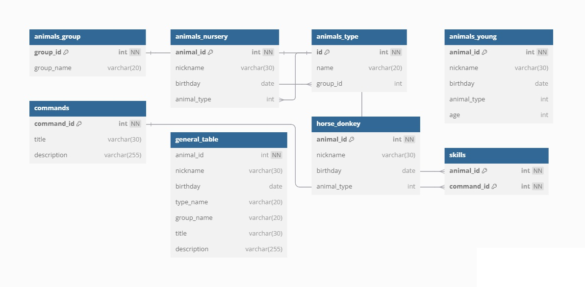

 # Итоговая контрольная работа
## Информация о проекте
Необходимо организовать систему учета для питомника в котором живут
домашние и вьючные животные.

Задание
1. Используя команду `cat` в терминале операционной системы Linux, создать
   два файла Домашние животные (заполнив файл собаками, кошками,
   хомяками) и Вьючные животными заполнив файл Лошадьми, верблюдами и
   ослы), а затем объединить их. Просмотреть содержимое созданного файла.
   Переименовать файл, дав ему новое имя (Друзья человека).

````commandline
 dmitriy@Demin-VM:~$  cat > Pets
 собака 1
 кот 1
 собака 2
 собака 3
 хомяк 1
 кот 2
````
````commandline
 dmitriy@Demin-VM:~$ cat > Pack_animals
 лошадь 1
 лошадь2
 осел 1
 верблюд 1
 верблюд 2
 верблюд 3
````
````commandline 
  dmitriy@Demin-VM:~$ ls -al
````
````commandline
вывод
-rw-rw-r--  1 dmitriy dmitriy    74 сен  9 20:48  Pack_animals
-rw-rw-r--  1 dmitriy dmitriy    67 сен  9 20:46  Pets
````
````commandline
   dmitriy@Demin-VM:~$ cat Pack_animals Pets > Human_friends
   dmitriy@Demin-VM:~$ ls -al

````
````commandline
вывод
-rw-rw-r--  1 dmitriy dmitriy   141 сен  9 20:54  Human_friends
-rw-rw-r--  1 dmitriy dmitriy    74 сен  9 20:48  Pack_animals
-rw-rw-r--  1 dmitriy dmitriy    67 сен  9 20:46  Pets
````
2. Создать директорию, переместить файл туда.
````commandline
   dmitriy@Demin-VM:~$ mkdir AniamalNursery
   dmitriy@Demin-VM:~$ mv Humad_friends AniamalNursery/
````
````commandline
итого 12
drwxrwxr-x  2 dmitriy dmitriy 4096 сен  9 21:52 .
drwxr-x--- 25 dmitriy dmitriy 4096 сен  9 21:52 ..
-rw-rw-r--  1 dmitriy dmitriy  141 сен  9 20:54 Human_friends
````
3. Подключить дополнительный репозиторий MySQL. Установить любой пакет
   из этого репозитория.
   Для подключения дополнительного репозитория необходимо добавить конфигационный файл
с адресом добавляемого репо в директорию `/etc/apt/ources.list.d` после чего добавить 
ключ репозитория для подтверждения безопасности.
```commandline
dmitriy@Demin-VM:/etc/apt/sources.list.d$ ls -al
итого 24
drwxr-xr-x 2 root root 4096 авг 26 22:14 .
drwxr-xr-x 9 root root 4096 июл 21 17:56 ..
-rw-r--r-- 1 root root  112 авг 13 19:35 docker.list
-rw-r--r-- 1 root root  650 авг 26 19:11 mysql.list
-rw-r--r-- 1 root root  386 июл 21 17:56 ubuntu.sources
-rw-r--r-- 1 root root 2552 апр 24 14:51 ubuntu.sources.curtin.orig
```


4. Установить и удалить deb-пакет с помощью dpkg.
   Скачайте deb-пакет. Например, мы будем устанавливать vivaldi.
```commandline
   dmitriy@Demin-VM:~$ wget -E https://downloads.vivaldi.com/stable/vivaldi-stable_6.9.3447.41-1_amd64.deb
   dmitriy@Demin-VM:~$ sudo dpkg -i vivaldi-stable_6.9.3447.41-1_amd64.deb
   dmitriy@Demin-VM:~$ sudo dpkg -r vivaldi-stable
   ```
5. Выложить историю команд в терминале ubuntu
6. Нарисовать диаграмму, в которой есть класс родительский класс, домашние
   животные и вьючные животные, в составы которых в случае домашних
   животных войдут классы: собаки, кошки, хомяки, а в класс вьючные животные
   войдут: Лошади, верблюды и ослы).



7. В подключенном MySQL репозитории создать базу данных “Друзья
   человека”




```commandline
mysql> CREATE DATABASE human_friends;
mysql> USE human_friends;
```
8. Создать таблицы с иерархией из диаграммы в БД
```commandline
mysql> CREATE TABLE animals_group
    -> (
    -> id INT PRIMARY KEY NOT NULL AUTO_INCREMENT,
    -> name VARCHAR(20)
    -> );
```
```commandline
mysql> CREATE TABLE animals_type
    -> (
    -> id INT PRIMARY KEY NOT NULL AUTO_INCREMENT,
    -> name VARCHAR(20),
    -> group_id INT,
    -> FOREIGN KEY (group_id) REFERENCES animals_group (id)
    -> ON DELETE CASCADE ON UPDATE CASCADE
    -> );
```
```commandline
mysql> CREATE TABLE commands
    -> (
    -> id INT PRIMARY KEY NOT NULL AUTO_INCREMENT,
    -> title VARCHAR(30),
    -> description VARCHAR(255)
    -> );
```
```commandline
mysql> CREATE TABLE animals_nursery
    -> (
    -> id INT PRIMARY KEY NOT NULL AUTO_INCREMENT,
    -> nickname VARCHAR(30),
    -> birthday DATE,
    -> animal_type INT,
    -> FOREIGN KEY (animal_type) REFERENCES animals_type (id)
    -> ON DELETE CASCADE ON UPDATE CASCADE
    -> );
```
```commandline
mysql> CREATE TABLE `human_friends`.`skills` (
    -> (
    -> animal_id INT NOT NULL,
    -> command_id INT NOT NULL,
    -> PRIMARY KEY (`animal_id`, `command_id`),
    -> INDEX `skills_command_id_fk2_idx` (`command_id` ASC) VISIBLE,
    -> CONSTRAINT `skills_animal_id_fk1`
      -> FOREIGN KEY (`animal_id`)
      -> REFERENCES `human_friends`.`animals_nursery` (`id`)
      -> ON DELETE CASCADE
      -> ON UPDATE CASCADE,
    -> CONSTRAINT `skills_command_id_fk2`
      -> FOREIGN KEY (`command_id`)
      -> REFERENCES `human_friends`.`commands` (`id`)
      -> ON DELETE CASCADE
      -> ON UPDATE CASCADE)
    -> ENGINE = InnoDB
    -> DEFAULT CHARACTER SET = utf8mb4
    -> COLLATE = utf8mb4_0900_ai_ci;
```
9. Заполнить низкоуровневые таблицы именами(животных), командами 
которые они выполняют и датами рождения

````commandline
mysql> INSERT INTO commands (`title`, `description`) 
    -> VALUES ('Кличка', 'Первая команда,которую изучает  питомец — это отклик на свое имя. По сути это сигнал, 
    -> что нужно сосредоточиться на последующих указаниях владельца, то есть аналог команде «Внимание!».');
    -> ('Ко мне', 'Одна из основных команд, предполагающая, что собака по зову хозяина подбежит к нему,
    -> даже без поводка, даже если она увлечена игрой, даже если ее внимание привлек интересный стимул.'),
    -> ('Нельзя', 'Чрезвычайно важные команды, означающие, что питомцу требуется прекратить действие,
    -> которое он начал или намеревается выполнить в ближайшее время.'),
    -> ('Сидеть', 'Достаточно простая команда, которая бывает удобной, если питомца нужно сосредоточить,
    -> успокоить. Питомцу необходимо дать понюхать лакомство, после чего произнести команду и начать заводить руку
    -> с лакомством над его головой назад. Желая дотянуться до угощения, но не потерять равновесия, он сядет.'),
    -> ('Лежать', 'Команда лежать еще более полезна активным животным, так как тренирует выдержку.
    -> К тому же из этого положения сложнее сорваться с места, в отличие от положений стоя и сидя.'),
    -> ('Нельзя', 'Чрезвычайно важные команды, означающие, что питомцу требуется прекратить действие,'),
    -> ('Сидеть', 'Достаточно простая команда, которая бывает удобной, если собаку нужно сосредоточить,'),
    -> ('Лежать', 'Команда лежать еще более полезна активным животным, так как тренирует выдержку.'),
    -> ('Рядом', 'Эта команда необходима на улице, особенно если речь идет о крупном сильном животном, 
    -> которая легко может вырваться из рук владельца. При изучении этого навыка питомец идет на коротком поводке,
    -> и каждый раз, когда он идет вровень с ногой хозяина.
    -> ('Гуляй', 'Одна из любимых команд собаки, означающая, что можно перестать идти рядом и отправиться на 
    -> прогулку без поводка, в свободном темпе в зоне видимости владельца. Команда сама по себе является поощрением,
    -> поэтому ее осваивают без особых усилий'),
    -> ('Барьер', 'питомец по команде перепрыгивает препятствие.'),
    -> ('Место', 'уходит на специальное место, предварительно обозначенное хозяином.'),
    -> ('Апорт', 'Бежит за брошенным человеком предметом, приносит и возвращает его.'),
    -> ('Домой', 'приучается после прогулки следовать к дому и подъезду. Команда может 
    -> пригодиться в критической ситуации, когда питомца что-то напугало или он сорвался с поводка.');
```` 
```commandline
mysql> INSERT INTO `human_friends`.`animals_group` (`name`) VALUES ('Домашние животные');
mysql> INSERT INTO `human_friends`.`animals_group` (`name`) VALUES ('Вьючные животные');
```
```commandline
mysql>INSERT INTO `human_friends`.`animals_type` (`name`, `group_id`) VALUES ('Собака', '1');
mysql>INSERT INTO `human_friends`.`animals_type` (`name`, `group_id`) VALUES ('Кошка', '1');
mysql>INSERT INTO `human_friends`.`animals_type` (`name`, `group_id`) VALUES ('Хомяк', '1');
mysql>INSERT INTO `human_friends`.`animals_type` (`name`, `group_id`) VALUES ('Лошадь', '2');
mysql>INSERT INTO `human_friends`.`animals_type` (`name`, `group_id`) VALUES ('Верблюд', '2');
mysql>INSERT INTO `human_friends`.`animals_type` (`name`, `group_id`) VALUES ('Осел', '2');
```
```commandline

INSERT INTO `human_friends`.`animals_nursery` (`nickname`, `birthday`, `animal_type`) VALUES ('Бакс', '2017-03-13', '1');
INSERT INTO `human_friends`.`animals_nursery` (`nickname`, `birthday`, `animal_type`) VALUES ('Федя', '2011-06-16', '2');
INSERT INTO `human_friends`.`animals_nursery` (`nickname`, `birthday`, `animal_type`) VALUES ('Вася', '2018-04-21', '2');
INSERT INTO `human_friends`.`animals_nursery` (`nickname`, `birthday`, `animal_type`) VALUES ('Лорд', '2020-02-13', '3');
INSERT INTO `human_friends`.`animals_nursery` (`nickname`, `birthday`, `animal_type`) VALUES ('Мурсик', '2018-07-11', '2');
INSERT INTO `human_friends`.`animals_nursery` (`nickname`, `birthday`, `animal_type`) VALUES ('Ветка', '2021-09-18', '1');
INSERT INTO `human_friends`.`animals_nursery` (`nickname`, `birthday`, `animal_type`) VALUES ('Нитка', '2015-02-02', '6');
INSERT INTO `human_friends`.`animals_nursery` (`nickname`, `birthday`, `animal_type`) VALUES ('Ветерок', '2022-08-08', '4');
INSERT INTO `human_friends`.`animals_nursery` (`nickname`, `birthday`, `animal_type`) VALUES ('Гром', '2013-03-11', '4');
INSERT INTO `human_friends`.`animals_nursery` (`nickname`, `birthday`, `animal_type`) VALUES ('Сивка', '2010-01-01', '5');
```
```commandline
INSERT INTO `human_friends`.`skills` (`animal_id`, `command_id`) VALUES ('1', '5');
INSERT INTO `human_friends`.`skills` (`animal_id`, `command_id`) VALUES ('1', '6');
INSERT INTO `human_friends`.`skills` (`animal_id`, `command_id`) VALUES ('1', '23');
INSERT INTO `human_friends`.`skills` (`animal_id`, `command_id`) VALUES ('1', '24');
INSERT INTO `human_friends`.`skills` (`animal_id`, `command_id`) VALUES ('1', '25');
INSERT INTO `human_friends`.`skills` (`animal_id`, `command_id`) VALUES ('2', '5');
INSERT INTO `human_friends`.`skills` (`animal_id`, `command_id`) VALUES ('2', '31');
INSERT INTO `human_friends`.`skills` (`animal_id`, `command_id`) VALUES ('3', '5');
INSERT INTO `human_friends`.`skills` (`animal_id`, `command_id`) VALUES ('4', '24');
INSERT INTO `human_friends`.`skills` (`animal_id`, `command_id`) VALUES ('4', '25');

```
   
10. Удалив из таблицы верблюдов, т.к. верблюдов решили перевезти в другой
    питомник на зимовку. Объединить таблицы лошади, и ослы в одну таблицу.
```commandline
mysql> DELETE FROM animals_nursery WHERE animal_type=5;
```
```commandline
mysql> CREATE TABLE horse_donkey AS
    -> SELECT * FROM animals_nursery WHERE animal_type=4
    -> UNION
    -> SELECT * FROM animals_nursery WHERE animal_type=6;
```
11. Создать новую таблицу “молодые животные” в которую попадут все
    животные старше 1 года, но младше 3 лет и в отдельном столбце с точностью
    до месяца подсчитать возраст животных в новой таблице
```commandline
mysql> CREATE TABLE animals_young AS
    -> SELECT id, nickname, birthday, animal_type,
    -> DATEDIFF(CURDATE(),birthday) DIV 31 AS age FROM animals_nursery
    -> WHERE date_add(birthday, INTERVAL 1 YEAR) < curdate()
    -> AND date_add(birthday, INTERVAL 3 YEAR) > curdate();
```
12. Объединить все таблицы в одну, при этом сохраняя поля, указывающие на
    прошлую принадлежность к старым таблицам.
````commandline
CREATE TABLE general_table AS
(SELECT A.animal_id, A.nickname, A.birthday, B.name AS type_name, C.group_name, E.title, E.description FROM animals_nursery AS A
INNER JOIN animals_type AS B ON A.animal_type = B.id
INNER JOIN animals_group AS C ON B.group_id = C.group_id
INNER JOIN skills AS D ON A.animal_type = D.animal_id
INNER JOIN commands AS E ON D.command_id = E.command_id);
````

13. Создать класс с Инкапсуляцией методов и наследованием по диаграмме.
14. Написать программу, имитирующую работу реестра домашних животных.
    В программе должен быть реализован следующий функционал:
    14.1.  Завести новое животное
    14.2.  определять животное в правильный класс
    14.3.  увидеть список команд, которое выполняет животное
    14.4.  обучить животное новым командам
    14.5.  Реализовать навигацию по меню 
15. Создайте класс Счетчик, у которого есть метод add(), увеличивающий̆
    значение внутренней̆int переменной̆на 1 при нажатие “Завести новое
    животное” Сделайте так, чтобы с объектом такого типа можно было работать в
    блоке try-with-resources. Нужно бросить исключение, если работа с объектом
    типа счетчик была не в ресурсном try и/или ресурс остался открыт. Значение
    считать в ресурсе try, если при заведения животного заполнены все поля.